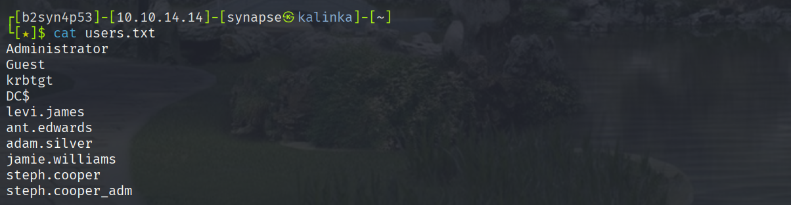
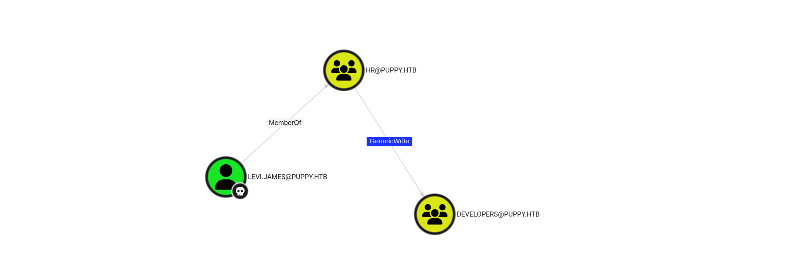

# HTB Writeup Puppy

## Initial Reconnaissance

```zsh
nmap -A xx.xx.xx.xx --min-rate 10000
Starting Nmap 7.95 ( https://nmap.org ) at 2025-05-17 15:00 EDT
Nmap scan report for xx.xx.xx.xx
Host is up (0.097s latency).
Not shown: 985 filtered tcp ports (no-response)

PORT      STATE SERVICE      VERSION
53/tcp    open  domain       Simple DNS Plus
88/tcp    open  kerberos-sec Microsoft Windows Kerberos (server time: 2025-05-18 02:00:50Z)
111/tcp   open  rpcbind      2-4 (RPC #100000)
1/tcp   open  msrpc        Microsoft Windows RPC
139/tcp   35open  netbios-ssn  Microsoft Windows netbios-ssn
389/tcp   open  ldap         Microsoft Windows Active Directory LDAP (Domain: PUPPY.HTB)
445/tcp   open  microsoft-ds?
464/tcp   open  kpasswd5?
593/tcp   open  ncacn_http   Microsoft Windows RPC over HTTP 1.0
636/tcp   open  tcpwrapped
2049/tcp  open  nlockmgr     1-4 (RPC #100021)
3260/tcp  open  iscsi?
3268/tcp  open  ldap         Microsoft Windows Active Directory LDAP (Domain: PUPPY.HTB)
3269/tcp  open  tcpwrapped
5985/tcp  open  http         Microsoft HTTPAPI httpd 2.0 (SSDP/UPnP)
```

**Credentials: levi.james : KingofAkron2025!**

```zsh
rm -f /home/b2syn4p53/.nxc/workspaces/default/smb.db 
```

```zsh
nxc smb puppy.htb -u 'levi.james' -p 'KingofAkron2025!' --rid-brute | grep "SidTypeUser" | \
awk -F '\\' '{print $2}' | awk '{print $1}' > users.txt  
```
Der erste Befehl löscht die NXC Workspace Datenbank.
Der zweite Befehl enumeriert Benutzerkonten vom SMB-Server `PUPPY.HTB` über RID-Bruteforce, filtert nur tatsächliche Benutzerkonten heraus und extrahiert **Benutzernamen**, die dann in die Datei `users.txt` gespeichert werden.  **SidTypeUser sind normale AD-Benutzer.**



### BloodHound Enumeration

```zsh
bloodhound-python -dc dc.puppy.htb -u 'levi.james' -p 'KingofAkron2025!' \
-d puppy.htb -c All -o bloodhound_results.json -ns xx.xx.xx.xx
```

